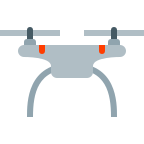
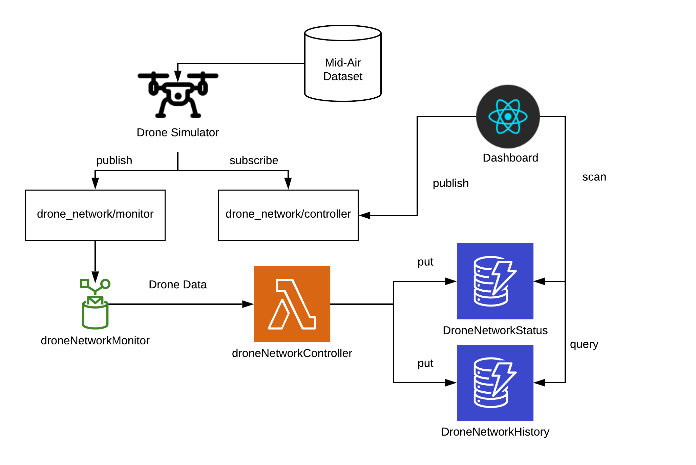
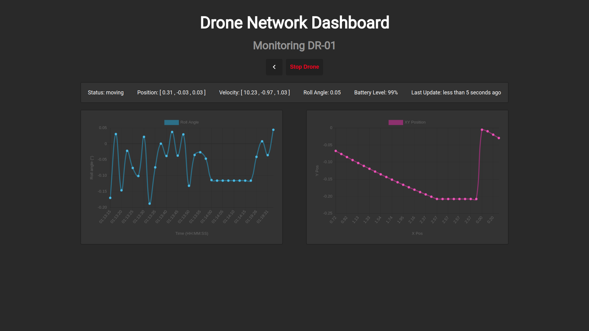

   

# AWS Drone Monitor

> A proof of concept drone monitoring system using AWS.

This project tires to simulate and monitorate a simple drone network using the cloud platform AWS. A IoT device is simulated, sending predetermined sensor data (velocity, position, accelerometer) collected from a dataset. The full system diagram can be seen below:
 

In short, a drone is simulated through a AWS IoT device, which publishes messagens containing fake data that simulates the drone status to a AWS topic that activates a Lambda function that processes the data and stores the it in a DynamoDB table including the device identification. At the end a web application build using React will scan the DynamoDB and display the drone status.

## Prerequisites

* You have at least `node 10.X` installed.

## Getting Started

The source code is separeted in three folders/parts:

* **aws_lambda:** source code for the AWS lambda functions, written in node. Two lambda functions were used, `data_controller.js` to update the drone status (also keeping a history) by inserting data in a DynamoDB table, and `device_registration.js` which registrates the drone itself in a table.
* **dummy_drone:** source code for the drone simulator written in node, that publishes the fake data contained in the `.json` files.
* **web_dashboards:** source code for the dashboard web application written in React, that scans and displays the drone status, also displaying some charts.

## Acknowledgements

* Drone svg icon downloaded  from [icons8](https://icons8.com/).

## License

This project uses the following license: [MIT](https://github.com/Davidsksilva/drone-network-dashboard/blob/master/LICENSE.md).
